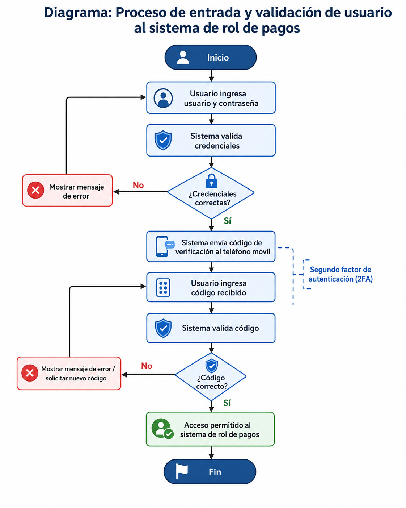

# Diagrama del proceso de login, password y código móvil

El siguiente diagrama representa el proceso de entrada y validación del usuario al sistema de rol de pagos.

El flujo considera:

1. Ingreso de usuario y contraseña.
2. Validación de credenciales.
3. Envío de código al teléfono móvil.
4. Validación del código recibido.
5. Acceso permitido o rechazo del ingreso.

